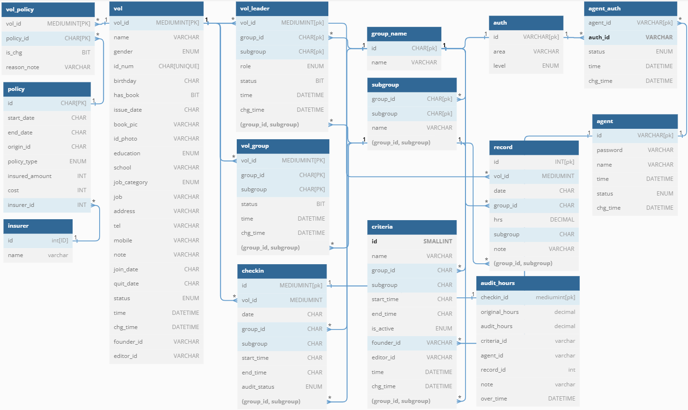
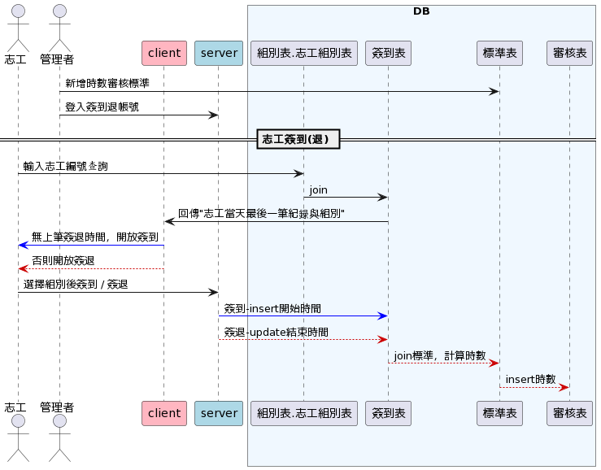
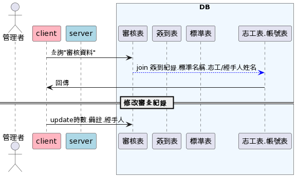
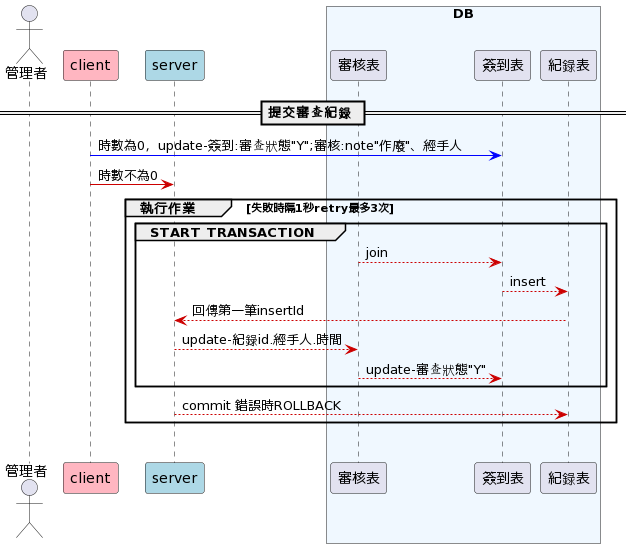

# grateful to have you

  
本系統以志工單位實際需求建立各項功能，旨在輕鬆管理志工資料以及時數計算，並且可以根據不同組別設定管理權限。

## 功能特色

### 志工基本資料管理
- 多條件複合查詢
- 分權分組管理
- 新增、編輯志工資料
- 志工照片管理
### 時數管理
- 線上簽到(退)
- 自訂審查標準
- 分組審查時數
### 時數統計
- 依志工歷年統計
- 依組別及年度統計
### 權限管理
- 新增帳號
- 修改帳號
- 設定權限

## 展示
網址：https://xinyu.site/

展示帳號：
- 管理者admin（密碼相同）
- 主管AAA（密碼相同）
- 組長DDD（密碼相同）
- 簽到public（密碼相同）

## 技術架構
### 後端技術
- Node.js/Express.js
- RDS MySQL
- EC2、S3、CloudFront、Route 53
- Docker、SSL、NGINX、JSON Web Token(JWT)
- 主要套件：aws-sdk、bcrypt、cookie-parser、jsonwebtoken、joi、moment
- 其他應用：MVC 架構、資料庫第三正規化
### 前端使用套件
- axios
- bootstrap
- datatable
## 資料庫架構

## 簽到(退)流程

## 時數審核流程

## 聯絡
👩‍💻陳心渝 Xinyu Chen
📬Email: imxinyu@hotmail.com

