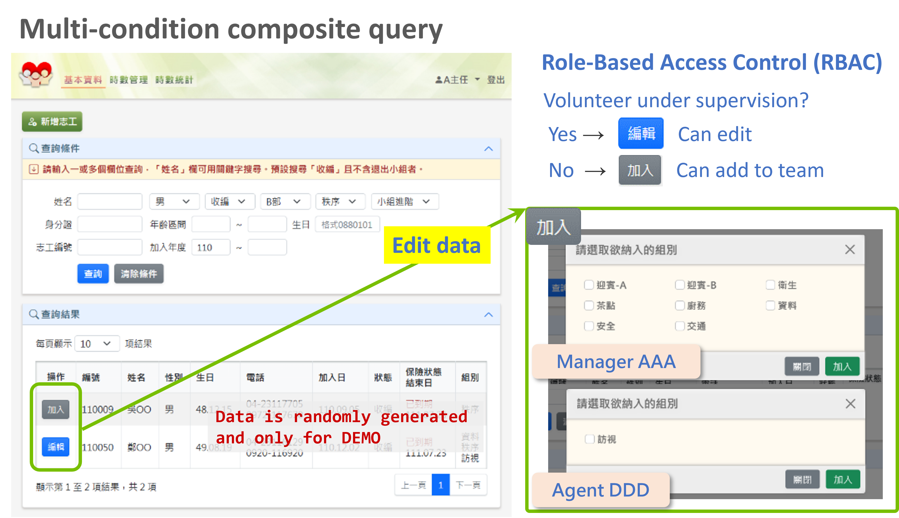
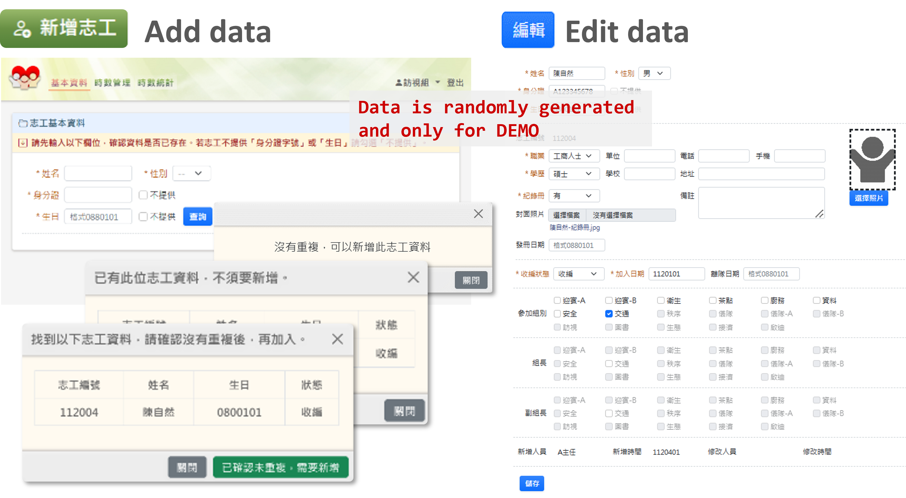
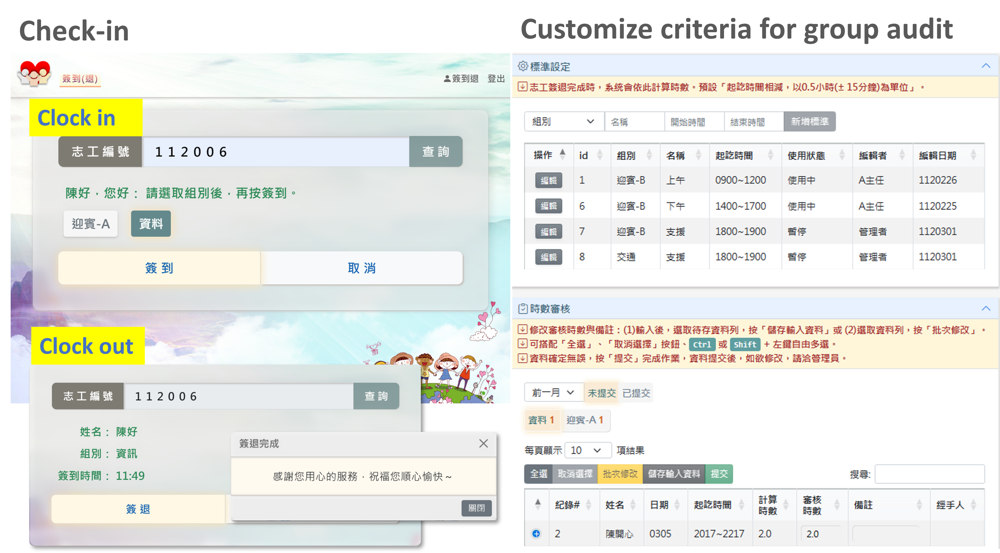
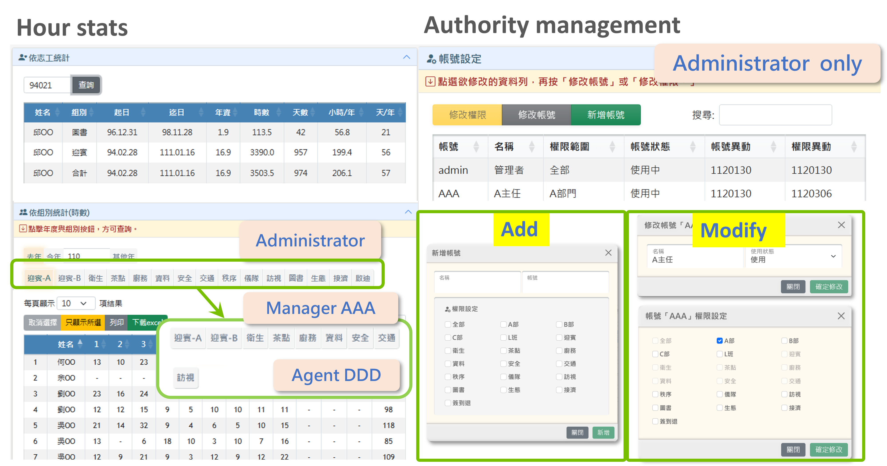
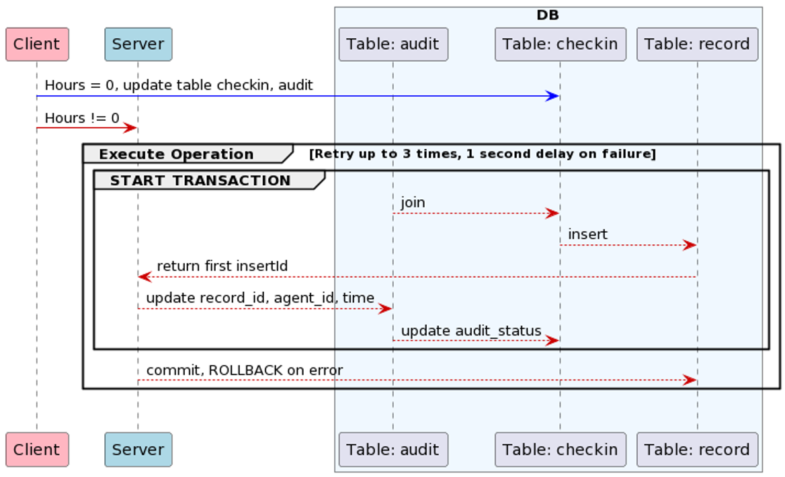

# Grateful to have you


The project facilitates volunteer and data management with Role-Based Access Control (RBAC) to ensure proper user access levels. It offers a user-friendly interface for managing volunteers and their data.

🌏 https://vol.xinyu.site/
📢 Disclaimer: Demo data is randomly generated and should not be used for any real-world applications.
👤 Demo Accounts (User ID and password are identical) 

|  Role  |  User ID  |
| ----  | ----  |
|  Administrator  |  admin  |
| Agent Manager  | AAA |
| Agent  | DDD  |
| Public for Check-in  | public  |

Table of Contents
---
- [Grateful to have you](#grateful-to-have-you)
  - [Table of Contents](#table-of-contents)
  - [Demo for Main Features](#demo-for-main-features)
  - [Technologies](#technologies)
    - [Backend](#backend)
    - [Frontend](#frontend)
  - [Architecture](#architecture)
  - [Database Schema](#database-schema)
  - [Transaction Flowchart (Hours Audit)](#transaction-flowchart-hours-audit)
  - [Contact](#contact)

Demo for Main Features
---


- Volunteer data management:  multi-condition composite query, add/edit data, photo management
  
  
- Hour management: online check-in, customize criteria for group audit
  
- Hour stats: volunteer year-by-year, group and annual
- Authority management: add/modify account, set permissions



Technologies
---
### Backend
- Node.js / Express.js
- Docker
- NGINX
- CloudFare
  - DNS records, SSL
- AWS
  - EC2
  - RDS MySQL, ElastiCache Redis
  - S3, CloudFront
- MVC architecture
- JWT-based authorization
  - Access token is automatically refreshed using Axios-interceptors and refresh token before expiration
  - Refresh token is removed from Redis on logout
- Database with 3NF schema, indexing, function, store procedure, and transaction support, prevent SQL injection attacks with parameterized queries
- Role-Based Access Control (RBAC)
- Security HTTP Header (Enhance application security with NGINX and helmet)

### Frontend
- HTML, CSS, Javascript, RWD
- Axios, Ajax
- Bootstrap
- Datatable

Architecture
---
- Backend: Node.js / Express.js, using NGINX reverse proxy on AWS EC2 with Docker
- ElastiCache Redis: for storing refresh tokens
- RDS MySQL: for storing application data
- S3 / CloudFront: for storing and accelerating volunteer images
  


Database Schema
---
- Volunteer: `vol`
- Volunteer insurance policy: `policy`,`insurer`,`vol_policy`
- Group:
  - `group_name`,`subgroup`: groups can have none or several subgroups
  - `vol_group`: volunteer can join one or many groups
  - `vol_leader`: each group has leader and vice-leader
- Authority:
  - `agent`: include administrator, agent manager, agent, public
    > ```Reserved for future expansion to provide volunteer login, the term "agent" is used to distinguish from volunteer accounts.```
  - `auth`: defines authority areas, including sector (manager level), group (agent level) and check-in (public level)
  - `agent_auth`: agent can have several authorities
- Hour records: 
  - `checkin`: volunteer clock in/out record, preserved for 3 years
  - `criteria`: agent can customize criteria for check-in hour audits; if not set, default criteria is used
  - `audit_hours`: agent audit check-in hours
  - `record`:  integrated from `checkin` and `audit_hours` after audit is finished
  


## Transaction Flowchart (Hours Audit)
- Transactions ensure ACID properties of data: Atomicity, Consistency, Isolation, and Durability
- Inserting a new `record` requires updating related information in `audit_hours` and the audit_status in `checkin`
- Resource contention may result in a deadlock, requiring up to 3 retries with a 1-second interval


## Contact
👩‍💻 陳心渝 SINYU-YU CHEN  
📧 imxinyu@hotmail.com

